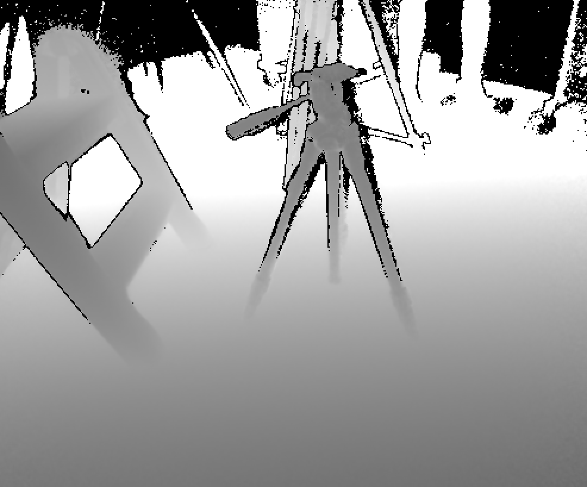
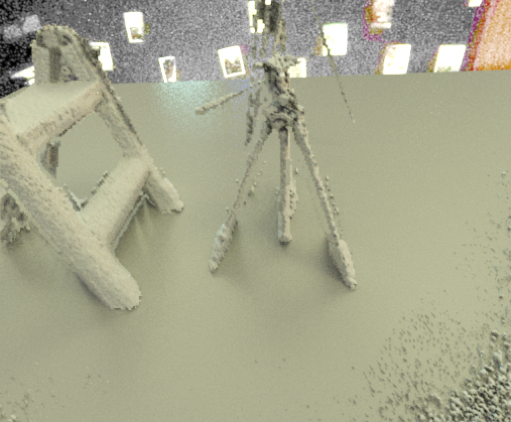

# Approximate Rendering Data Generation

The tools contained in this package are meant to generate renders using single depth maps as input, along with material and lighting parameters to be used with Mitsuba to generate the final image. The only functioning tool resides in the depth_grid_render directory, and a script to batch process data is in the scripts directory. Depth_grid_render takes some specifications of light and camera positions along with a depth map and generates a Wavefront OBJ mesh and a Mitsuba scene in XML format for rendering the recontsructed scene.

## Building
```bash
cd depth_grid_render
mkdir build
cd build
cmake ..
make
```

## Running the code

```
depth_grid_render filename envmap alpha maskfilename [-theta <value>] [-phi <value>] [-ltheta <value> -lphi <value>] [-c <occlusion threshold>] [-rt <ransac threshold>] [-nt <face angle threshold>] [-envscale <value>] [-norange 1] [-d <displacement factor>] [-output masks 1] [-s <scene format version>] [-correction <fac>] [-planetex <plane texture filename>] [-planescale <value>] [-envrot <value>] [-flip 1] [-r <resize factor>] [-randang <angle randomness magnitude in degrees>] [-randalpha <std>] [-nomodel 1] [-width <w>] [-height <h>] [-scenes (1|0){13}] [-save <name>]
```

## Examples using real data

Kinect sensor:

```
depth_grid_render /projects/grail/jamesn8/datasets/real/set4/saved_depth/Depth27.bmp /projects/grail/jamesn8/datasets/real/hdrmaps/set4/1-3200.JPG 1000 /projects/grail/jamesn8/datasets/real/set4/saved_depth/Depth27.bmp -mindepth 1 -maxdepth 254 -norange 1 -fov 70 -correction 0.05 -rt 0.5 -nt 150 -dt 0.1 -flip 1 -planescale 16 -envscale 1000 -envrot 45
```

This will align the mesh generated from the depth map using RANSAC to find the principal plane. The azimuthal angle of the environment map is further controlled using the `envrot` parameter, and the scale of the radiance values with -envscale (default 1 if your input is already an HDR map).

Other parameters:
- `rt`: ransac inlier distance threshold
- `nt`: twice the maximum angle deviation for deleting faces close to the plane (degrees)
- `dt`: distance threshold for deleting faces close to the plane
- `correction`: scale to apply to the whole 3D model (applied before the aforementioned thresholds are used)
- `fov`: field of view of the depth sensor (70 for the kinect sensor)
- `norange`: do not correct range values to depth values if receiving depth as input (true for kinect sensor)
- `mindepth` and `maxdepth`: clipping values for the depth values in the raw image to use in reconstruction (0-255 for a standard LDR image)



